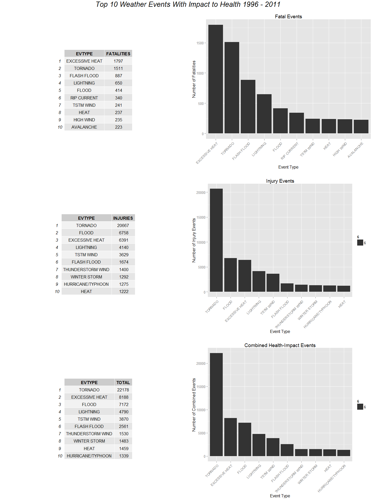

# Severe Weather - Health and Property Impacts Analysis
Analyst: James Schacht  
Report Compiled: July, 2015  
##Synopsis
###Background
<p>
This report uses data from the <a href=https://www.ncdc.noaa.gov/" target="_blank">National Oceanic and Atmospheric Administration's (NOAA)</a> National Climatic Data Center database to provide a descriptive analysis of event types causing human harm and economic impact to property. 
</p>
<p>
Although the data source spans from 1950, the year it was first captured, through 2011-11-30, agency directive "10-1605", introduced January 1996, provides a consistent data set with modern context. More information about the data collection and processing evolution can be found <a href="https://www.ncdc.noaa.gov/stormevents/details.jsp" target="_blank">here</a>.  This report uses a subset of the data beginning 1996-01-01 through 2011-11-30.
</p>
<p>
<a href="https://d396qusza40orc.cloudfront.net/repdata%2Fpeer2_doc%2FNCDC%20Storm%20Events-FAQ%20Page.pdf" target="_blank">Source Data FAQ</a>
</p>
###What the Data Shows
...


##Data Processing
###R Packages Used: dplyr, lubridate, gridExtra, ggplot2

```r
suppressPackageStartupMessages(library(dplyr))
```

```
## Warning: package 'dplyr' was built under R version 3.1.3
```

```r
suppressPackageStartupMessages(library(lubridate))
```

```
## Warning: package 'lubridate' was built under R version 3.1.3
```

```r
suppressPackageStartupMessages(library(ggplot2))
```

```
## Warning: package 'ggplot2' was built under R version 3.1.3
```

```r
suppressPackageStartupMessages(library(grid))
suppressPackageStartupMessages(library(gridExtra))
```

```
## Warning: package 'gridExtra' was built under R version 3.1.3
```


```r
download.file("http://d396qusza40orc.cloudfront.net/repdata%2Fdata%2FStormData.csv.bz2", "NOAAdata.csv.bz2", mode="wb")
stormdata <- read.csv("NOAAdata.csv.bz2")
stormdata$EVTYPE <- gsub("^\\s+|\\s+$", "", stormdata$EVTYPE)
stormdata <- mutate(stormdata, BGN_DATE = mdy_hms(BGN_DATE))
indx <- which(stormdata$BGN_DATE >= "1996-01-01")
stormdata <- stormdata[indx,]
cols_people <- c(8,23:24)
cols_property <- c(8,25:28)
df_people <- select(stormdata,cols_people)
df_property <- select(stormdata,cols_property)
df_property$PROPDMGEXP <- tolower(df_property$PROPDMGEXP)
df_property$CROPDMGEXP <- tolower(df_property$CROPDMGEXP)
df_people_fatalities <- group_by(df_people, EVTYPE) %>% summarize(sum(FATALITIES))
df_people_injuries <- group_by(df_people, EVTYPE) %>% summarize(sum(INJURIES))
names(df_people_fatalities) <- c("EVTYPE","FATALITIES")
names(df_people_injuries) <- c("EVTYPE","INJURIES")
df_people_fatalities <- arrange(df_people_fatalities,desc(FATALITIES))
df_people_injuries <- arrange(df_people_injuries,desc(INJURIES))
df_people_combined <- full_join(df_people_fatalities,df_people_injuries)
```

```
## Joining by: "EVTYPE"
```

```r
df_people_combined <- mutate(df_people_combined,TOTAL = FATALITIES + INJURIES)
df_people_combined <- select(df_people_combined,EVTYPE,TOTAL)
df_people_combined <- arrange(df_people_combined,desc(TOTAL))
tbl_fatalities <- tableGrob(head(df_people_fatalities, n = 10))
tbl_injuries <- tableGrob(head(df_people_injuries, n = 10))
tbl_combined <- tableGrob(head(df_people_combined, n = 10))
Fplot <- 
    qplot(factor(EVTYPE,levels=unique(EVTYPE)),
        data=head(df_people_fatalities, n =10), 
        weight=FATALITIES, 
        geom="bar", 
        binwidth=20,
        main="Fatal Events",
        ylab="Number of Fatalities",
        xlab="Event Type") +
    theme(axis.text.x = element_text(angle = 45, hjust = 1))
Iplot <- 
    qplot(factor(EVTYPE,levels=unique(EVTYPE)),
        data=head(df_people_injuries, n =10), 
        weight=INJURIES, 
        geom="bar", 
        binwidth=20,
        main="Injury Events",
        ylab="Number of Injury Events",
        xlab="Event Type",
        size=6) +
    theme(axis.text.x = element_text(angle = 45, hjust = 1))
Cplot <- 
    qplot(factor(EVTYPE,levels=unique(EVTYPE)),
        data=head(df_people_combined, n =10), 
        weight=TOTAL, 
        geom="bar", 
        binwidth=20,
        main="Combined Health-Impact Events",
        ylab="Number of Combined Events",
        xlab="Event Type",
        size=6) +
    theme(axis.text.x = element_text(angle = 45, hjust = 1))
```

```r
#p_vp <- viewport(h=1.2,w=1.2)
grid.arrange(tbl_fatalities,
             Fplot,
             tbl_injuries,
             Iplot,
             tbl_combined,
             Cplot,
             top = textGrob("Top 10 Weather Events With Impact to Health 1996 - 2011",gp=gpar(fontsize=20,font=3)),
             ncol = 2,
             nrow = 3)
```

 

##Results


```r
#rm(list=ls())
```
